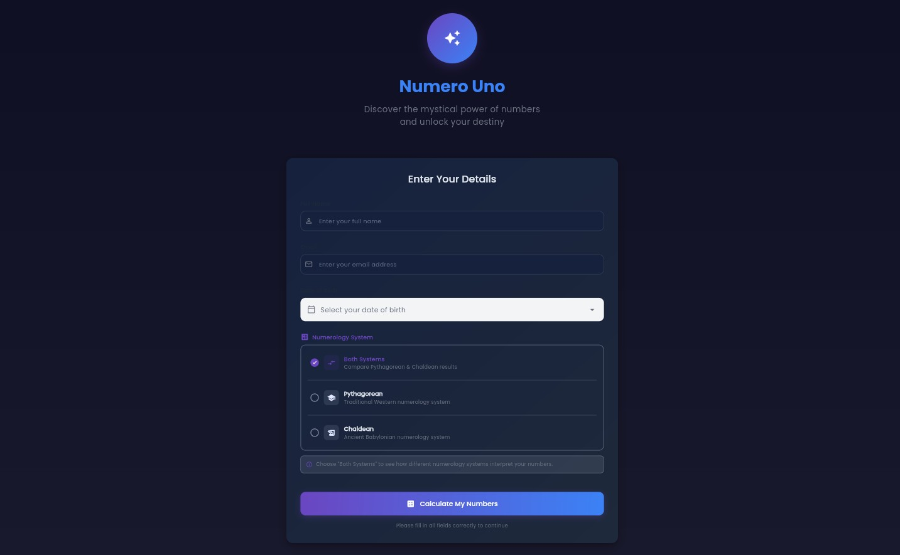
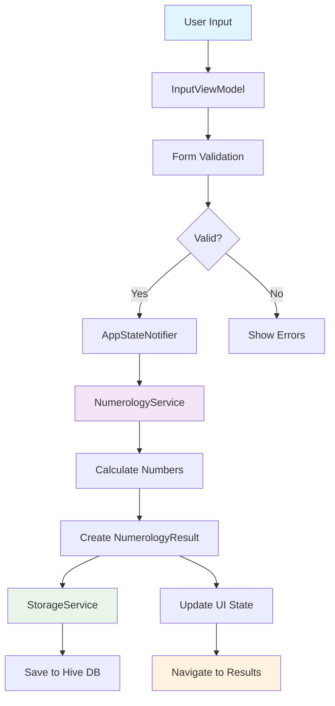
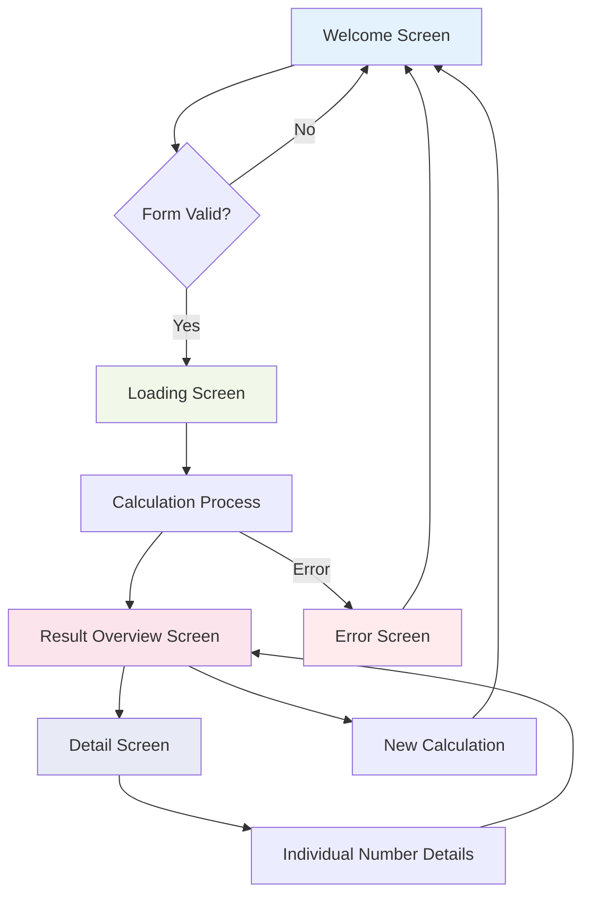

# Numero Uno - Numerology Calculator 🔮

A comprehensive Flutter application that calculates and analyzes numerological values based on user's personal information. Discover the mystical power of numbers and unlock insights about your personality, life path, and destiny through ancient numerology wisdom.

Visit - [awes0m.github.io/numero_uno](awes0m.github.io/numero_uno)

## 📱 App Overview

**Numero Uno** is a modern, beautifully designed numerology calculator that provides users with detailed insights into their personal numerological profile. The app calculates five core numerological numbers and presents them with detailed interpretations and meanings.



### ✨ Key Features

- **Life Path Number**: Reveals your life's purpose and the path you're meant to walk
- **Birthday Number**: Represents your natural talents and abilities
- **Expression Number**: Shows your life's goal and what you're meant to accomplish
- **Soul Urge Number**: Represents your inner desires and what motivates you
- **Personality Number**: Shows how others perceive you and your outer personality
- **Local Storage**: Saves calculation history using Hive database
- **Responsive Design**: Optimized for mobile, tablet, and desktop platforms
- **Dark/Light Theme**: Complete theming support with smooth transitions
- **Smooth Animations**: Beautiful UI animations and transitions using Flutter Animate

## 🏗️ Architecture

The app follows **MVVM (Model-View-ViewModel)** architecture pattern with **Riverpod** for state management:

```text
lib/
├── config/          # App configuration (theme, routing)
├── models/          # Data models (Hive entities)
├── providers/       # Riverpod providers
├── services/        # Business logic services
├── viewmodels/      # State management logic
├── views/           # UI components
│   ├── screens/     # Screen widgets
│   └── widgets/     # Reusable UI components
└── utils/           # Utility functions
```

## 📊 Data Flow Diagram



## 🔄 UI Flow Diagram



## 🧮 Numerology Calculation Process

The app implements traditional numerology calculation methods:

### 1. Life Path Number

- **Input**: Full date of birth (DD/MM/YYYY)
- **Process**: Reduce day, month, and year to single digits, then sum and reduce again
- **Example**: 15/03/1990 → 6+3+9 = 18 → 1+8 = 9

### 2. Expression Number

- **Input**: Full name
- **Process**: Convert each letter to its numerological value (A=1, B=2... I=9, J=1...)
- **Sum**: All letter values and reduce to single digit

### 3. Soul Urge Number

- **Input**: Full name (vowels only)
- **Process**: Same as Expression but only counting vowels (A, E, I, O, U)

### 4. Personality Number

- **Input**: Full name (consonants only)
- **Process**: Same as Expression but only counting consonants

### 5. Birthday Number

- **Input**: Day of birth
- **Process**: Reduce day number to single digit

## 🎯 Interactive Results Overview Screen - Feature Documentation

The new Interactive Results Overview Screen revolutionizes how users interact with their numerology results by replacing the static, scrollable layout with a dynamic, tabbed interface that organizes information into logical, digestible sections.

### ✨ Key Features

### 1. **Responsive TabBar Navigation**

- **5 organized tabs** for better content organization
- **Smooth animations** and transitions between tabs
- **Mobile-first design** with scrollable tabs on smaller screens
- **Consistent theming** with gradient indicators and mystical styling

### 2. **rganized Content Structure**

#### 🌟 **Core Numbers Tab**

- Life Path, Birthday, Expression, Soul Urge, Personality numbers
- System comparison (Pythagorean vs Chaldean) when both are available
- Responsive grid layout (mobile: column, tablet/desktop: 2-column grid)

#### ⚡ **Advanced Numbers Tab**

- Driver, Destiny, First Name, Full Name numbers
- Name compatibility analysis
- Advanced numerological insights

##### 📈 **Life Analysis Tab**

- Pinnacles and Challenges timeline
- Personal Years predictions
- Essences and life cycles
- Interactive period displays

##### 🔮 **Mystical Features Tab**

- Interactive Loshu Grid visualization
- Karmic Lessons and Debts analysis
- Missing and Magical numbers insights
- Ancient wisdom interpretations

##### 💡 **Insights Tab**

- AI Share functionality
- Action buttons for recalculation
- App footer and additional resources
- Export and sharing options

#### 3. **Enhanced User Experience**

##### **Compact Header**

- Always-visible user information
- Quick Life Path number display
- Mystical animated icon
- Streamlined design

##### **Interactive Elements**

- Animated number cards with hover effects
- Smooth tab transitions
- Progressive disclosure of information
- Touch-friendly interface

##### **Responsive Design**

- Mobile: Single column layout with optimized spacing
- Tablet: 2-column grid for better space utilization
- Desktop: Enhanced grid with larger cards and spacing
- Consistent experience across all devices

## 🛠 Technical Implementation

#### **Architecture**

- **HookConsumerWidget** for state management with Riverpod
- **TabController** for smooth tab navigation
- **Responsive utilities** for cross-platform compatibility
- **Modular widget structure** for easy maintenance

#### **Key Components**

```dart
// Main screen with 5 tabs
class InteractiveResultOverviewScreen extends HookConsumerWidget

// Tab structure
TabBar(
  tabs: [
    'Core Numbers',    // Main 5 numerology numbers
    'Advanced',        // Additional numbers
    'Life Analysis',   // Pinnacles, challenges, cycles
    'Mystical',        // Loshu grid, karmic insights
    'Insights',        // AI share, actions
  ]
)
```

#### **Responsive Grid System**

```dart
ResponsiveUtils.responsiveBuilder(
  context: context,
  mobile: _buildMobileGrid(),     // Single column
  tablet: _buildTabletGrid(),     // 2 columns
  desktop: _buildDesktopGrid(),   // 2 columns, larger
)
```

### 🎨 Design Philosophy

#### **Progressive Disclosure**

- Information is organized by importance and user journey
- Core numbers are presented first
- Advanced features are accessible but not overwhelming
- Mystical elements maintain the app's spiritual theme

#### **Visual Hierarchy**

- **Section headers** with icons and descriptions
- **Color-coded categories** for different types of information
- **Consistent spacing** and typography
- **Gradient accents** for visual appeal

#### **Accessibility**

- **High contrast** color schemes
- **Touch-friendly** button sizes
- **Screen reader** compatible
- **Keyboard navigation** support

### 🚀 Benefits

#### **For Users**

1. **Reduced Cognitive Load**: Information is chunked into digestible sections
2. **Faster Navigation**: Direct access to specific information types
3. **Better Mobile Experience**: Optimized for touch interaction
4. **Scalable Interface**: Easy to add new features without cluttering

#### **For Developers**

1. **Modular Architecture**: Each tab is a separate, maintainable component
2. **Easy Feature Addition**: New tabs or sections can be added seamlessly
3. **Consistent Patterns**: Reusable components and layouts
4. **Future-Proof Design**: Structure supports additional numerology features

### 📱 Usage Examples

#### **Navigation Flow**

1. User completes numerology calculation
2. Lands on **Core Numbers** tab by default
3. Can swipe or tap to explore other sections
4. Each tab loads with smooth animations
5. Information is contextually organized

#### **Feature Discovery**

- **Core Numbers**: Essential numerology insights
- **Advanced**: Deep dive into name energy
- **Life Analysis**: Timeline-based predictions
- **Mystical**: Ancient wisdom and spiritual insights
- **Insights**: AI-powered analysis and sharing

### 🔄 Migration Strategy

#### **Backward Compatibility**

- Original `ResultOverviewScreen` remains available as "Classic View"
- Users can toggle between Interactive and Classic modes
- Gradual migration path for existing users

#### **Feature Toggle**

```dart
// Smart navigation based on user preference
SmartNavigator.toResults(context, ref);

// View preference provider
final viewPreferenceProvider = StateProvider<bool>((ref) => true);
```

### 🎯 Future Enhancements

#### **Planned Features**

1. **Customizable Tab Order**: Let users reorder tabs based on preference
2. **Bookmarking**: Save favorite sections for quick access
3. **Detailed Animations**: Enhanced transitions and micro-interactions
4. **Offline Mode**: Cache results for offline viewing
5. **Export Options**: PDF generation for each tab section

#### **Advanced Interactions**

1. **Swipe Gestures**: Enhanced mobile navigation
2. **Voice Navigation**: Accessibility improvements
3. **Search Functionality**: Find specific numerology insights
4. **Comparison Mode**: Side-by-side system comparisons

### 📊 Performance Considerations

#### **Optimizations**

- **Lazy Loading**: Tabs load content only when accessed
- **Efficient Rendering**: Minimal rebuilds with proper state management
- **Memory Management**: Proper disposal of controllers and listeners
- **Smooth Animations**: 60fps transitions with optimized widgets

#### **Bundle Size**

- **Minimal Dependencies**: Uses existing Flutter and app dependencies
- **Code Reuse**: Leverages existing widgets and utilities
- **Tree Shaking**: Unused code is eliminated in production builds

### 🧪 Testing Strategy

#### **Unit Tests**

- Tab navigation logic
- Data transformation methods
- Responsive layout calculations

#### **Widget Tests**

- Tab content rendering
- Animation behavior
- User interaction handling

### **Integration Tests**

- End-to-end user flows
- Cross-platform compatibility
- Performance benchmarks

### 📈 Success Metrics

#### **User Experience**

- **Reduced bounce rate** on results screen
- **Increased time spent** exploring results
- **Higher feature discovery** rate
- **Improved user satisfaction** scores

#### **Technical Metrics**

- **Faster load times** for specific sections
- **Reduced memory usage** through lazy loading
- **Improved accessibility** scores
- **Cross-platform consistency** metrics

---

### 🎉 Conclusion

The Interactive Results Overview Screen represents a significant upgrade to the Numero Uno app's user experience. By organizing content into logical, accessible sections and providing smooth, responsive navigation, users can now explore their numerology results in a more intuitive and engaging way.

The modular architecture ensures that new features can be added seamlessly, making this implementation not just a current improvement but a foundation for future enhancements.

**Ready to explore your mystical numbers in a whole new way! ✨**

## AI Share Feature - Numero

The AI Share feature allows users to generate comprehensive, AI-friendly prompts from their numerology results that can be pasted into any AI assistant (ChatGPT, Claude, Gemini, etc.) for deeper insights and predictions.

### Features

#### 1. Multiple Analysis Types

- **Complete Analysis**: Full numerology report with predictions
- **Quick Insights**: Today's energy and key guidance
- **Relationship Match**: Compatibility analysis with partner
- **Career Guidance**: Professional path and opportunities

#### 2. Comprehensive Data Export

The AI prompts include:

- All core numerology numbers (Life Path, Expression, Soul Urge, etc.)
- Loshu Grid analysis with magical and missing numbers
- Karmic lessons and debts
- Life cycles (Pinnacles and Challenges)
- Current year personal year and essence numbers
- Multi-year forecast
- Name compatibility analysis
- System comparison (if both Pythagorean and Chaldean calculated)

#### 3. Current Date Context

- Automatically includes today's date for time-specific analysis
- Requests current day/month/year fortune reports
- Asks for favorable dates and timing guidance

#### 4. Easy Access

- Dedicated AI Share widget on the results screen
- Quick access via the share button in the app bar
- Copy to clipboard functionality
- Share via system share dialog

### How to Use

#### From the Results Screen

1. Scroll down to the "Share to AI Assistant" section
2. Choose your preferred analysis type:
   - Complete Analysis (comprehensive)
   - Quick Insights (brief)
   - Relationship Match (requires partner info)
   - Career Guidance (professional focus)
3. For relationship analysis, optionally enter partner's name and birth date
4. Tap "Copy AI Prompt" to copy to clipboard
5. Paste into any AI assistant for detailed analysis

#### From the Share Menu

1. Tap the share icon in the app bar
2. Select "Share to AI Assistant"
3. The comprehensive prompt is automatically copied to clipboard
4. Paste into your preferred AI assistant

### Sample AI Prompt Structure

=== NUMEROLOGY ANALYSIS REQUEST ===

Please analyze the following comprehensive numerology data and provide:

1. Current day/month/year fortune and energy forecast
2. Detailed personality insights based on the numbers
3. Life path guidance and recommendations
4. Compatibility insights for relationships and career
5. Predictions and opportunities for the coming months
6. Karmic lessons and spiritual growth areas
7. Lucky numbers, colors, and favorable dates
8. Challenges to be aware of and how to overcome them

=== PERSONAL INFORMATION ===
Full Name: [User's Name]
Date of Birth: [Birth Date]
Analysis Date: [Calculation Date]
Current Date: [Today's Date]
Numerology System: [Pythagorean/Chaldean]

=== CORE NUMEROLOGY NUMBERS ===
Life Path Number: [Number]
  (The most important number - your life's purpose and journey)

[... detailed breakdown of all numbers ...]

=== SPECIFIC ANALYSIS REQUEST FOR TODAY ===
Today's Date: [Current Date]

Please provide specific insights for:

1. Today's energy and opportunities
2. This month's focus and themes
3. This year's major lessons and growth areas
4. Favorable dates and periods in the coming months
5. Relationships and compatibility insights
6. Career and financial guidance
7. Health and wellness recommendations
8. Spiritual development suggestions

## Technical Implementation

### Files Added

- `lib/services/ai_share_service.dart` - Service for generating AI prompts
- `lib/views/widgets/ai_share_widget.dart` - UI widget for AI share functionality

### Files Modified

- `lib/views/screens/result_overview_screen.dart` - Added AI share integration

### Key Classes

- `AiShareService` - Static methods for generating different types of AI prompts
- `AiShareWidget` - Interactive widget for selecting analysis type and generating prompts

## Benefits

1. **Deeper Insights**: Get personalized predictions beyond basic numerology meanings
2. **Current Context**: Receive guidance specific to today's date and current life phase
3. **Multiple Perspectives**: Choose different analysis focuses (career, relationships, etc.)
4. **AI-Optimized**: Prompts are structured for optimal AI understanding and response
5. **Comprehensive Data**: All numerology data is included for complete analysis
6. **Easy to Use**: Simple copy-paste workflow with any AI assistant

## Future Enhancements

- Direct integration with AI APIs
- Saved prompt templates
- Historical analysis tracking
- Custom prompt customization
- Multi-language support for prompts

## 🛠️ Technical Stack

### Core Technologies

- **Flutter**: Cross-platform UI framework
- **Dart**: Programming language

### State Management

- **Riverpod**: Modern state management solution
- **Flutter Hooks**: Simplified widget state management

### Local Storage

- **Hive**: Fast, lightweight NoSQL database
- **Shared Preferences**: Simple key-value storage

### UI/UX Libraries

- **Google Fonts**: Custom typography
- **Flutter Animate**: Smooth animations and transitions
- **Responsive Utils**: Cross-platform responsive design

### Development Tools

- **Build Runner**: Code generation
- **Hive Generator**: Model generation
- **Equatable**: Value equality comparisons

## 📁 Key Components

### Models

- `NumerologyResult`: Core result data structure
- `UserData`: User input data model
- `AppState`: Application state management

### Services

- `NumerologyService`: Core calculation engine
- `StorageService`: Data persistence layer

### Providers

- `appStateProvider`: Global app state
- `inputFormProvider`: Form state management
- `themeProvider`: Theme switching

### Screens

- `WelcomeScreen`: Main input form
- `LoadingScreen`: Calculation progress
- `ResultOverviewScreen`: Results summary
- `DetailScreen`: Individual number details
- `ErrorScreen`: Error handling

## 🚀 Getting Started

### Prerequisites

- Flutter SDK (3.8.1 or higher)
- Dart SDK
- Android Studio / VS Code with Flutter extension

### Installation

1. **Clone the repository**

```bash
git clone <repository-url>
cd numero_uno
```

2. **Install dependencies**

```bash
flutter pub get
```

3. **Generate code**

```bash
flutter packages pub run build_runner build
```

4. **Run the app**

```bash
flutter run
```

### Building for Production

```bash
# Android
flutter build apk --release

# iOS
flutter build ios --release

# Web
flutter build web --release

# Desktop
flutter build windows --release
flutter build macos --release
flutter build linux --release
```

## 🎨 Theming

The app supports both light and dark themes with:

- Custom color schemes
- Gradient backgrounds
- Consistent typography using Google Fonts
- Smooth theme transitions
- Responsive spacing and sizing

## 📱 Platform Support

- ✅ Android
- ✅ iOS
- ✅ Web
- ✅ Windows
- ✅ macOS
- ✅ Linux

## 🧪 Testing

```bash
# Run unit tests
flutter test

# Run widget tests
flutter test test/widget_test.dart
```

## 📝 License

This project is licensed under the MIT License - see the [LICENSE](LICENSE) file for details.

## 🤝 Contributing

1. Fork the repository
2. Create your feature branch (`git checkout -b feature/amazing-feature`)
3. Commit your changes (`git commit -m 'Add some amazing feature'`)
4. Push to the branch (`git push origin feature/amazing-feature`)
5. Open a Pull Request

## 📧 Support

For support and questions, please open an issue in the GitHub repository.

---

*"Numbers are the highest degree of knowledge. It is knowledge itself." - Plato*
